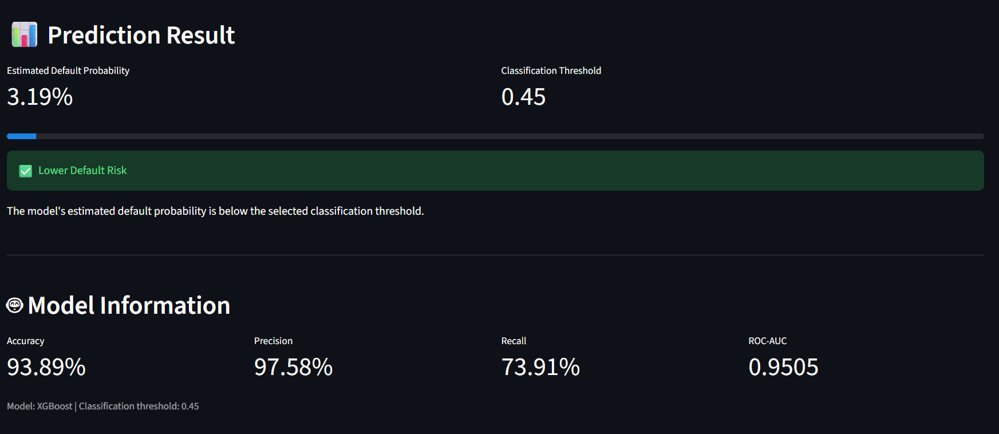

# Customer Credit Risk & Loan Default Prediction

## 📌 Project Overview

This project develops a machine learning system to predict the probability of loan default based on customer and loan-related information.

The project includes data preprocessing, exploratory data analysis, machine learning model comparison, threshold analysis, feature importance, SHAP explainability, and a Streamlit web application.

## 📸 Application Preview



## 🎯 Objective

The main objective is to build a machine learning model that can identify customers who may have a higher probability of loan default.

## 📊 Dataset

The dataset contains 32,581 customer loan records with 12 variables related to:

- Customer demographics
- Income
- Employment history
- Home ownership
- Loan purpose
- Loan grade
- Loan amount
- Interest rate
- Loan-to-income ratio
- Previous default history
- Credit history

Target variable:

- `0` = No Default
- `1` = Default

## 🧹 Data Preprocessing

The following preprocessing steps were performed:

- Duplicate removal
- Missing-value treatment
- Invalid-value detection
- Numerical feature scaling
- Categorical feature encoding
- Stratified train-test split

After cleaning, the dataset contained 32,409 records.

## 🔍 Exploratory Data Analysis

The project analyzes relationships between loan default and:

- Loan grade
- Loan intent
- Home ownership
- Income
- Loan amount
- Interest rate
- Loan-to-income percentage
- Previous default history
- Credit history

## 🔄 Machine Learning Workflow

```text
Dataset
   ↓
Data Cleaning & Validation
   ↓
Exploratory Data Analysis
   ↓
Feature Preprocessing
   ↓
Train-Test Split
   ↓
Model Training
   ↓
Model Comparison
   ↓
XGBoost Model
   ↓
Confusion Matrix & Threshold Analysis
   ↓
Feature Importance & SHAP Explainability
   ↓
Streamlit Prediction Application

## 🤖 Machine Learning Models

Four classification algorithms were evaluated:

1. Logistic Regression
2. Decision Tree
3. Random Forest
4. XGBoost

## 📈 Model Performance

| Model | Accuracy | Precision | Recall | F1-Score | ROC-AUC |
|---|---:|---:|---:|---:|---:|
| Logistic Regression | 80.59% | 53.89% | 78.21% | 63.81% | 0.8715 |
| Decision Tree | 88.35% | 71.46% | 77.86% | 74.52% | 0.9115 |
| Random Forest | 93.49% | 96.98% | 72.50% | 82.97% | 0.9374 |
| XGBoost | 93.89% | 97.58% | 73.91% | 84.11% | 0.9505 |

## 🔎 Model Explainability

XGBoost feature importance and SHAP analysis were used to understand the factors influencing model predictions.

Important predictive features included:

- Loan percent of income
- Person income
- Interest rate
- Home ownership
- Loan grade
- Loan intent
- Employment length
- Loan amount

Feature importance represents predictive contribution and does not establish causation.

## 🎚️ Threshold Analysis

The default classification threshold was evaluated across multiple values.

Among the tested thresholds from 0.10 to 0.90, a threshold of 0.45 produced the highest observed F1-score:

**F1-score = 0.8422**

The threshold was selected for the demonstration application based on this test-set analysis.

## 🌐 Streamlit Application

The project includes an interactive Streamlit application where users can enter customer and loan information and receive:

- Estimated default probability
- Predicted class
- Risk indication

## 🛠️ Technologies Used

- Python
- Pandas
- NumPy
- Scikit-learn
- XGBoost
- SHAP
- Matplotlib
- Seaborn
- Streamlit
- Google Colab
- GitHub

## 📁 Project Structure

```text
Customer-Credit-Risk-Loan-Default-Prediction/
│
├── app.py
├── models/
│   └── credit_risk_xgboost.pkl
├── notebooks/
│   └── Credit_Risk_Prediction.ipynb
├── requirements.txt
├── README.md
└── .gitignore
